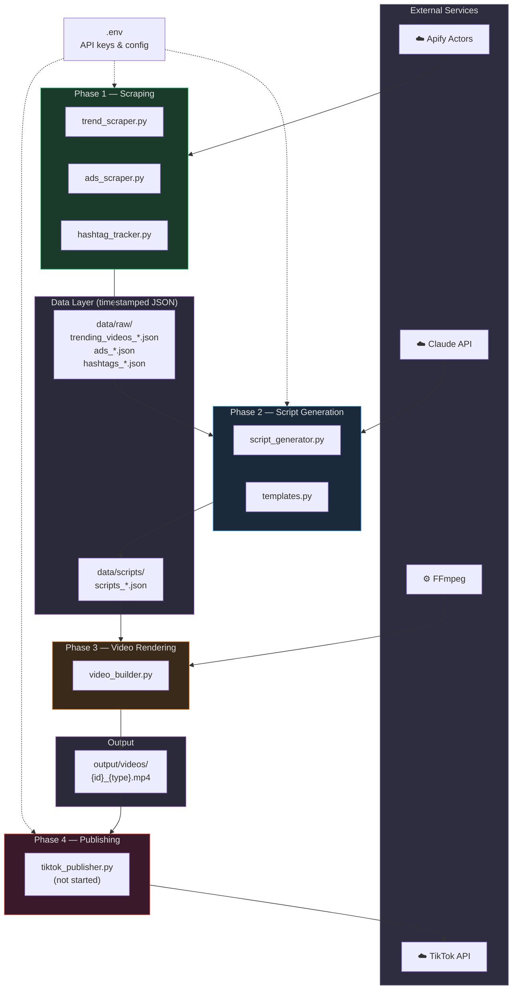
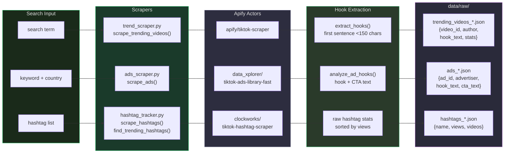
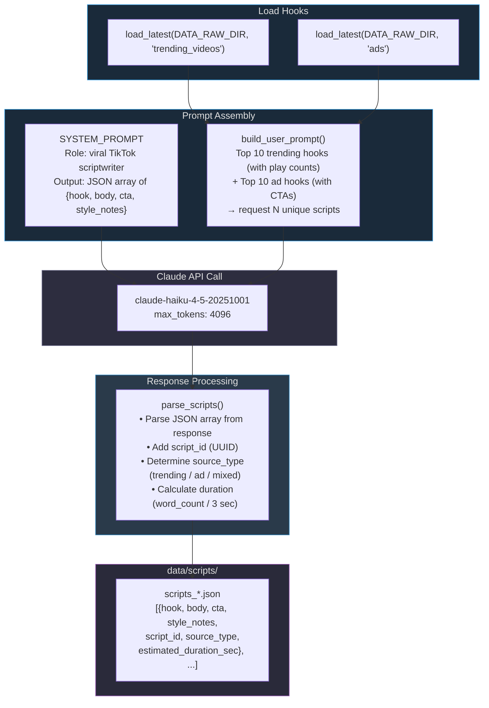
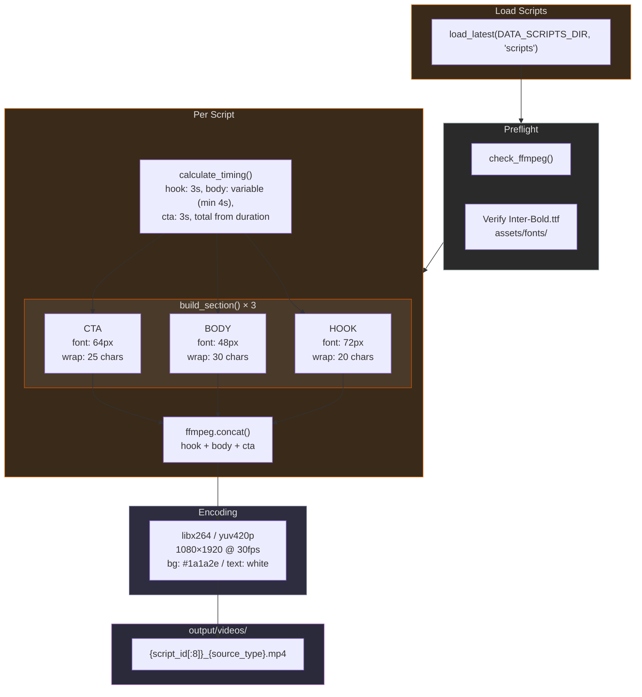
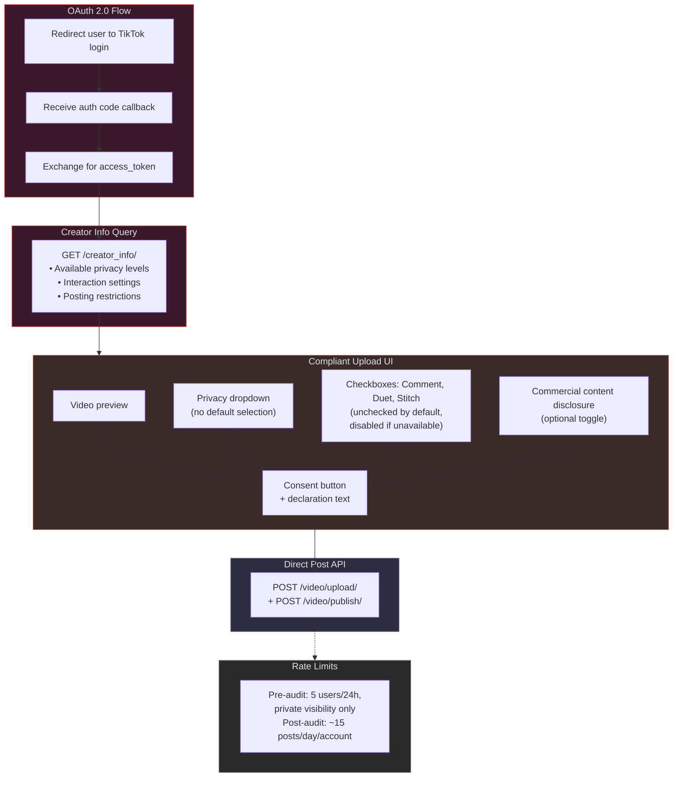
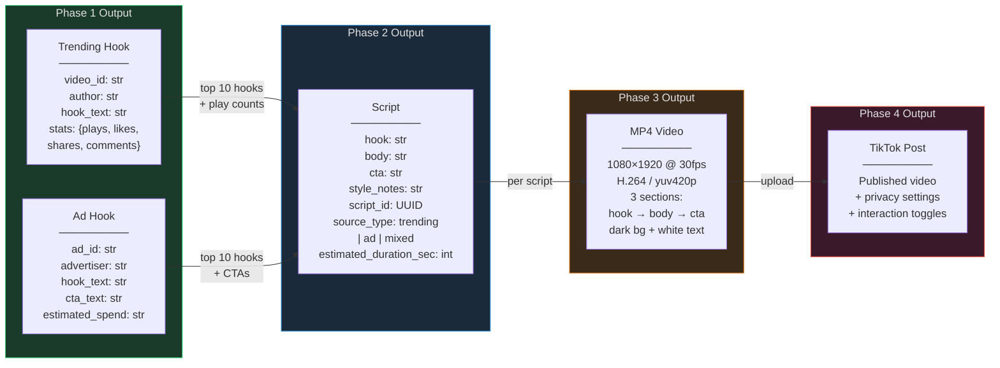
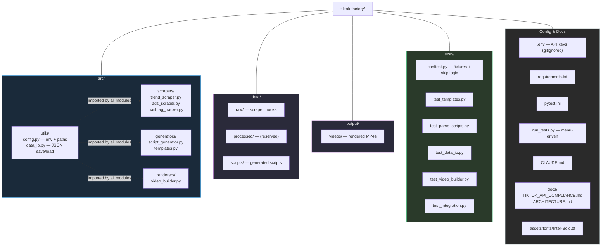
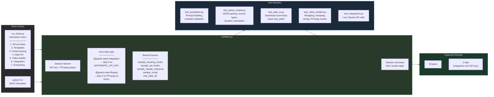

# TikTok Factory — Architecture

Visual documentation of the full pipeline. All diagrams render natively on GitHub using [Mermaid](https://docs.github.com/en/get-started/writing-on-github/working-with-advanced-formatting/creating-diagrams).

---

## 1. High-Level Pipeline

The four-phase pipeline. Each phase is independent — they communicate through timestamped JSON files on disk, not function calls.

---

## 2. Phase 1 — Scrapers

Three independent scrapers hit different Apify actors and write to `data/raw/`. Each follows the same pattern: `ApifyClient` → `actor.call()` → `iterate_items()` → extract/analyze → `save_json()`.

---

## 3. Phase 2 — Script Generation

Loads the latest scraped hooks, builds a prompt, calls Claude, and parses the response into enriched script objects.

---

## 4. Phase 3 — Video Rendering

Each script becomes a 9:16 vertical video with three sections (hook → body → CTA), concatenated and encoded as H.264.

---

## 5. Phase 4 — TikTok Publishing (Planned)

Not yet implemented. Must pass TikTok's API audit. See [`docs/TIKTOK_API_COMPLIANCE.md`](TIKTOK_API_COMPLIANCE.md) for full requirements.

---

## 6. Data Schema Flow

How data transforms as it moves through the pipeline.

---

## 7. Project Structure

---

## 8. Test Infrastructure

---

## Quick Reference

| Phase | Module | External Dep | Input | Output |
|-------|--------|-------------|-------|--------|
| 1 | `trend_scraper.py` | Apify (`apify/tiktok-scraper`) | search term | `trending_videos_*.json` |
| 1 | `ads_scraper.py` | Apify (`data_xplorer/tiktok-ads-library-fast`) | keyword | `ads_*.json` |
| 1 | `hashtag_tracker.py` | Apify (`clockworks/tiktok-hashtag-scraper`) | hashtag list | `hashtags_*.json` |
| 2 | `script_generator.py` | Claude API (`claude-haiku-4-5-20251001`) | hooks JSON | `scripts_*.json` |
| 3 | `video_builder.py` | FFmpeg (`libx264`) | scripts JSON | `{id}_{type}.mp4` |
| 4 | `tiktok_publisher.py` | TikTok Content Posting API | MP4 video | TikTok post |
