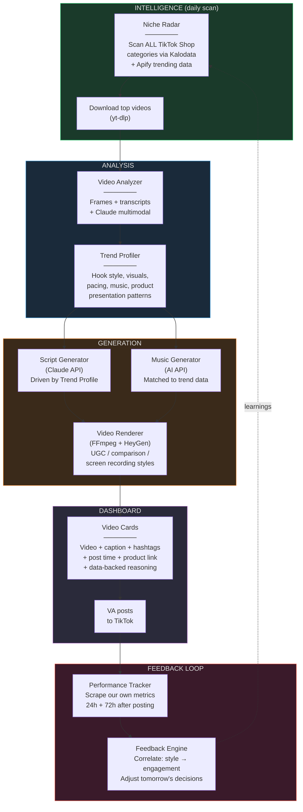
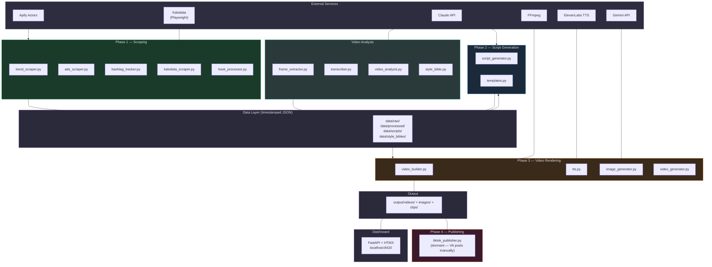
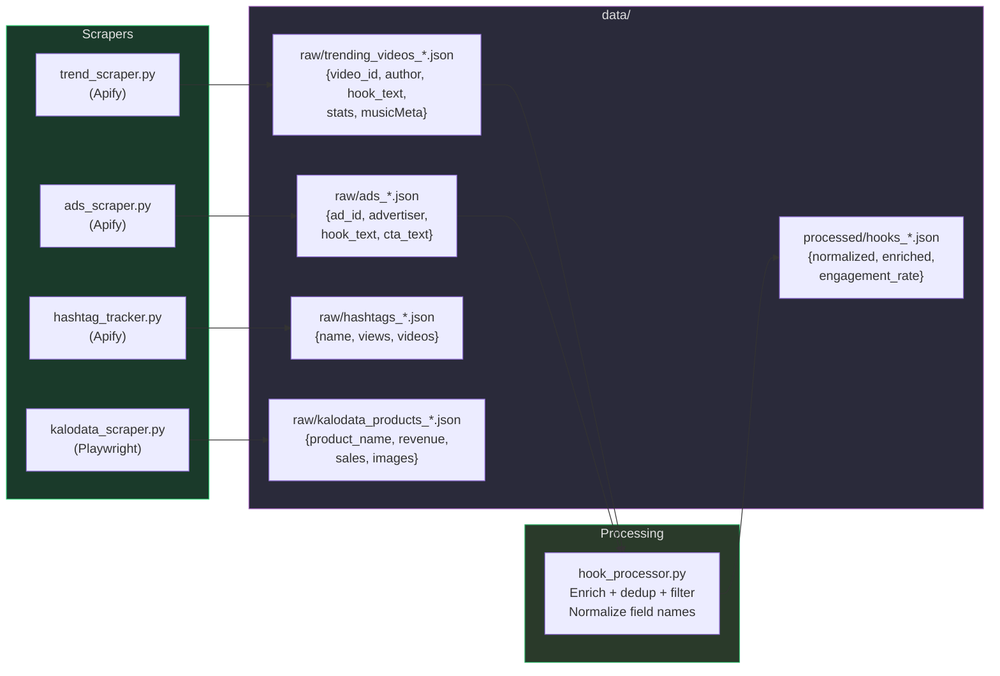
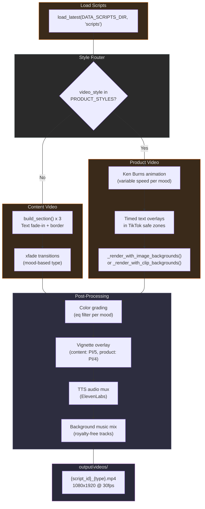
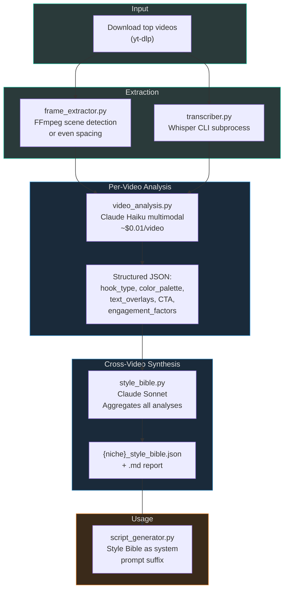
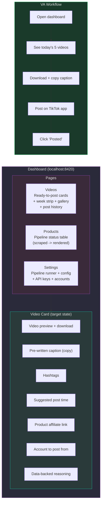

# TikTok Factory — Architecture

Visual documentation of the full pipeline. All diagrams render natively on GitHub using [Mermaid](https://docs.github.com/en/get-started/writing-on-github/working-with-advanced-formatting/creating-diagrams).

---

## 1. Target State — Autonomous Content Engine

The daily loop. Intelligence drives everything — the system picks what niche to target, what products to promote, and what video style to use based on scraped data.



---

## 2. Correct Pipeline Order — The Complete Dependency Graph

This is the correct logical order for every module in the system. Each step's output feeds the next step's input. The previous pipeline had two separate paths (smart pipeline and product pipeline) that each ran with incomplete data. This is the unified flow.

```
PHASE 0: DECIDE (what niche to target today)
  +-----------------------------------------+
  | 0. Niche Radar                          |
  |    Scan categories -> score -> pick     |
  |    niche -> generate pipeline_config    |
  +--------------------+--------------------+
                       |
                       v
PHASE 1: GATHER (all data for that niche, in parallel)
  +--------------+ +--------------+ +--------------+ +--------------+
  | 1a. Trend    | | 1b. Ads      | | 1c. Hashtag  | | 1d. Kalodata |
  |   Scraper    | |   Scraper    | |   Tracker    | |   Products   |
  +------+-------+ +------+-------+ +------+-------+ +------+-------+
         |                |                |                |
         v                v                v                v
  +-----------------------------------------+
  | 1e. Hook Processor                      |
  |     Normalize + dedup + filter + sort   |
  +--------------------+--------------------+
                       |
                       v
PHASE 2: LEARN (what's working in this niche)
  +-----------------------------------------+
  | 2a. Download top videos (from 1a data)  |
  | 2b. Extract frames + transcribe         |
  | 2c. Analyze each video (Claude)         |
  | 2d. Generate Style Bible                |
  +--------------------+--------------------+
                       |
                       v
  +-----------------------------------------+
  | 2e. Comparison (our old videos vs top)  |
  |     (skip if no old videos exist yet)   |
  +--------------------+--------------------+
                       |
                       v
PHASE 3: CREATE (scripts informed by ALL intelligence)
  +-----------------------------------------+
  | 3. Script Generator                     |
  |    Inputs: processed hooks (1e)         |
  |          + products (1d)                |
  |          + hashtags (1c)                |
  |          + Style Bible (2d)             |
  |          + comparison gaps (2e)         |
  +--------------------+--------------------+
                       |
                       v
PHASE 4: BUILD (turn scripts into videos)
  +-----------------------------------------+
  | 4a. Image Generator (Gemini)            |
  |     Scene images from scripts + products|
  |                                         |
  | 4b. Video Builder (FFmpeg)              |
  |     Scripts + images + TTS -> .mp4      |
  +--------------------+--------------------+
                       |
                       v
PHASE 5: DELIVER (VA posts from dashboard)
  +-----------------------------------------+
  | 5. Dashboard                            |
  |    Videos + captions + hashtags + timing |
  +-----------------------------------------+
```

### Module dependency table

| # | Module | Needs as input | Produces as output |
|---|--------|----------------|-------------------|
| 0 | Niche Radar | Apify token, Kalodata creds | Scored niches, per-account `pipeline_config.json` |
| 1a | Trend Scraper | Apify token, `search_queries` from config | `data/raw/trending_videos_*.json` |
| 1b | Ads Scraper | Apify token, `ad_keywords` from config | `data/raw/ads_*.json` |
| 1c | Hashtag Tracker | Apify token, `hashtags` from config | `data/raw/hashtags_*.json` |
| 1d | Kalodata Scraper | Kalodata creds, `categories` from config | `data/raw/products_*.json` + product images |
| 1e | Hook Processor | Raw trending videos (1a) + raw ads (1b) | `data/processed/processed_hooks_*.json` + `data/processed/processed_ad_hooks_*.json` |
| 2a | Video Downloader | `data/raw/trending_videos_*.json` (1a) | `.mp4` files in `videos/` |
| 2b | Frame Extractor + Transcriber | Downloaded `.mp4` files (2a) | Frames in `data/frames/` + transcripts in `data/transcripts/` |
| 2c | Video Analysis | Frames + transcripts (2b) | `data/analysis/analysis_{video_id}.json` |
| 2d | Style Bible | All per-video analyses (2c) | `data/style_bibles/{niche}_style_bible.json` |
| 2e | Comparison | Style Bible (2d) + our rendered videos (previous run) | Comparison report with gaps |
| 3 | Script Generator | Processed hooks (1e) + products (1d) + hashtags (1c) + Style Bible (2d) + comparison gaps (2e) | `data/scripts/scripts_*.json` |
| 4a | Image Generator | Scripts (3) + product images (1d) | `output/images/{script_id}/` |
| 4b | Video Builder | Scripts (3) + scene images (4a) + TTS audio | `output/videos/{script_id}_{type}.mp4` |
| 5 | Dashboard | Rendered videos (4b) + scripts (3) + products (1d) | Web UI on `localhost:8420` |

---

## 3. Phase-by-Phase Detailed Reference

### PHASE 0: DECIDE — "What niche should we target today?"

**Module:** `src/scrapers/niche_radar.py`

**What it does:**
- Scans 5 or 10 predefined niches (skincare, kitchen gadgets, pet products, haircare, supplements, fitness gear, phone accessories, cleaning, baby products, fashion accessories)
- For EACH niche, calls three scrapers: `trend_scraper` (Apify trending videos), `hashtag_tracker` (Apify hashtag stats), and optionally `kalodata_scraper` (Playwright product data)
- Scores each niche on 4 signals:
  - **engagement_score** (35%) — median engagement rate of top 5 videos. Baseline: 3% = 50, 8%+ = 100, <1% = 10
  - **velocity_score** (25%) — recency-weighted engagement. Videos from last 48h get full weight, older videos decay (96h = 0.7, 168h = 0.4, older = 0.1)
  - **gap_score** (20%) — demand/supply gap. High Kalodata product count + low creator saturation (videos with >100K views) = opportunity. Falls back to 50 (neutral) if no Kalodata data
  - **momentum_score** (20%) — week-over-week hashtag view growth compared to previous scan. No previous data = 50 (neutral)
- `recommend_accounts()` picks top 3 niches with diversity enforcement — no two recommended niches from the same `kalodata_cat`
- `build_niche_config()` generates a complete `pipeline_config.json` for each niche account
- `setup_accounts()` creates dashboard accounts with per-account configs and isolated directory trees

**What it produces:**
- `data/raw/niche_radar_*.json` — scored niches with reasoning, top hooks, scan metadata
- Per-account `pipeline_config.json` (via `build_niche_config()` + `save_account_config()`)

**Why it must go first:**
Every single module downstream reads `pipeline_config.json` to know what search queries to use, what hashtags to track, what Kalodata categories to scrape, what niche to reference in prompts, and what video style to use. If this config is wrong or stale, everything downstream is wrong. Niche Radar is the brain that writes the instructions for the rest of the machine.

**Known issue — double scraping:**
Niche Radar does its own scraping internally (calls `trend_scraper` and `hashtag_tracker` during the scan) but throws away the raw data — it only keeps the scores. Then Phase 1 scrapes the exact same data again. That's double the Apify cost for no reason. The fix: Niche Radar's scraping results should be saved and reused by Phase 1 instead of being discarded.

---

### PHASE 1: GATHER — "Collect all data for that niche"

Steps 1a-1d are independent of each other and can run in parallel. Step 1e depends on 1a + 1b.

#### Step 1a: Trend Scraper (`src/scrapers/trend_scraper.py`)

**Reads:** `pipeline_config.json` -> `search_queries` (e.g., `["skincare routine", "skincare tips", "glass skin"]`)

**Calls:** Apify actor `clockworks/tiktok-scraper` — one API call per search query

**Produces:** `data/raw/trending_videos_*.json` — raw video data with:
- `text` / `description` — full video caption
- `playCount` / `plays` — view count
- `diggCount` / `likes` — like count
- `shareCount` / `shares` — share count
- `commentCount` / `comments` — comment count
- `authorMeta` / `author` — creator name, fan count, verified status
- `musicMeta` — musicName, musicAuthor, musicId, playUrl (not yet utilized downstream)
- `webVideoUrl` — direct link to TikTok video (used by video downloader)
- `createTime` / `createTimeISO` — when the video was posted

**Field naming note:** Apify actors use inconsistent field names across versions. The codebase handles both conventions everywhere using `in` checks (not truthiness, because `0` is a valid value that would be falsy).

#### Step 1b: Ads Scraper (`src/scrapers/ads_scraper.py`)

**Reads:** `pipeline_config.json` -> `ad_keywords` (e.g., `["skincare", "moisturizer", "serum"]`)

**Calls:** Apify actor `data_xplorer/tiktok-ads-library-fast`

**Produces:** `data/raw/ads_*.json` — ad creatives with:
- `text` / `adText` — ad copy
- `callToAction` / `cta` — CTA text
- `advertiserName` / `advertiser` — who's paying
- `estimatedSpend` / `spend` — how much they're spending

**Why ads matter:** Organic hooks tell you what gets *views*. Ad hooks tell you what gets *purchases*. An ad spending $10K/day has been validated with real money. Those hooks are proven to drive conversions, not just engagement. The script generator uses both trending hooks and ad hooks, but the pipeline was previously skipping ads entirely.

#### Step 1c: Hashtag Tracker (`src/scrapers/hashtag_tracker.py`)

**Reads:** `pipeline_config.json` -> `hashtags` (e.g., `["skincare", "glowup", "beautytok"]`)

**Calls:** Apify actor `clockworks/tiktok-hashtag-scraper`

**Produces:** `data/raw/hashtags_*.json` — per-hashtag data with:
- `name` / `hashtag` — hashtag text
- `viewCount` / `views` — total views
- `videoCount` — number of videos using it
- Trend direction metadata

**Why hashtags matter:** The script generator uses these to populate `suggested_hashtags` on each script. Without this data, Claude guesses at hashtags instead of using ones with proven reach. Also used by Niche Radar's momentum scoring (week-over-week growth).

#### Step 1d: Kalodata Product Scraper (`src/scrapers/kalodata_scraper.py`)

**Reads:** `pipeline_config.json` -> `product_sources.kalodata.categories` (e.g., `["skincare", "beauty"]`)

**Calls:** Playwright (headless Chromium) — logs into Kalodata web UI, navigates to product rankings, scrapes table data

**Produces:**
- `data/raw/products_*.json` — product data with: title, price, revenue estimate, sales volume, trend direction, top video links, product image URLs, product_id
- Downloaded product images in `assets/product_images/` — these become the visual base for video rendering and the reference images for Gemini scene generation

**Why products are critical:** When `video_style` is `product_showcase`, `ugc_showcase`, or `comparison` in the config, the script generator switches to product mode. In product mode, it writes one script per product (overrides `num_scripts`). No products = the generator falls back to content mode silently. The image generator also needs product titles and reference images to create scene backgrounds.

**Requires:** `KALODATA_EMAIL` + `KALODATA_PASSWORD` in `.env`, plus Playwright + Chromium installed.

#### Step 1e: Hook Processor (`src/scrapers/hook_processor.py`)

**Reads:** Raw trending videos (1a) + raw ads (1b)

**Does:**
1. **Normalizes** inconsistent Apify field names (`playCount` vs `plays`, `authorMeta` vs `author`, `diggCount` vs `likes`)
2. **Extracts hook text** — first sentence of the caption under 150 characters, or first 100 chars if no sentence boundary found
3. **Calculates engagement rate** — `likes / plays` as a decimal (e.g., 0.05 = 5%)
4. **Extracts hashtags** from captions using regex (`#(\w+)`), falls back to structured hashtag data from Apify
5. **Extracts music info** from `musicMeta` field
6. **Deduplicates** by `video_id` (keeps the entry with higher engagement rate). Uses hook text as fallback key for entries without IDs
7. **Filters low-quality hooks** — removes empty text, text shorter than `min_hook_length` (default 15 chars), text where >50% of characters are hashtag tokens
8. **Sorts by engagement rate** descending — best-performing hooks first

**Produces:**
- `data/processed/processed_hooks_*.json` — enriched video hooks with normalized schema:
  ```
  video_id, author, author_fans, author_verified, hook_text, full_text,
  stats: {plays, likes, shares, comments, engagement_rate},
  video_duration_sec, hashtags, music, is_ad, url, created_at, source_query
  ```
- `data/processed/processed_ad_hooks_*.json` — enriched ad hooks with:
  ```
  ad_id, advertiser, hook_text, full_text, cta_text, estimated_spend
  ```

**Why processing matters:** The script generator tries to load from `data/processed/` first. If processed data exists, it gets clean, deduplicated, engagement-sorted hooks with full metadata. If it falls back to `data/raw/`, it gets messy Apify data with inconsistent field names and duplicates.

**Known issue:** Hook processing was previously only triggered from `trend_scraper.__main__` — it ran when you executed trend_scraper standalone but NOT when the pipeline called it as a subprocess. The orchestrator should call hook processing explicitly after scraping.

---

### PHASE 2: LEARN — "What's actually working in this niche?"

Steps 2a-2d are sequential (each depends on the previous). Step 2e runs after 2d.

#### Step 2a: Video Downloader (`src/analyzers/video_downloader.py`)

**Reads:** `data/raw/trending_videos_*.json` (from Step 1a) — needs the `webVideoUrl` field from each video

**Does:**
1. Loads the latest trending videos file via `load_latest(DATA_RAW_DIR, "trending_videos")`
2. Filters to videos with minimum play count (configurable via `analyzer.min_plays_for_download`, default 10,000)
3. Ranks all videos by engagement rate: `(likes + shares + comments) / plays`
4. Takes top N (configurable via `analyzer.download_top_n`, default 15)
5. Downloads each via `yt-dlp` subprocess, with 2-second delays between downloads
6. Skips already-downloaded files (deterministic filename: `{videoId}_{author}.mp4`)

**Produces:** `.mp4` files in `videos/` directory

**Why it must come after 1a:** Without trending video data, it has no URLs to download. The downloader explicitly checks for `data/raw/trending_videos_*.json` and prints "Run the trend scraper first (Phase 1)" if nothing is found. Previously the smart pipeline ran intelligence (which calls the downloader) BEFORE scraping, so on a fresh run with no existing data, the downloader found nothing and silently returned empty.

**Requires:** `yt-dlp` installed and on PATH (`pip install yt-dlp`). Falls back gracefully if not installed.

#### Step 2b: Frame Extraction + Transcription (`src/analyzers/frame_extractor.py` + `src/analyzers/transcriber.py`)

**Reads:** Downloaded `.mp4` files from `videos/`

**Frame extractor does:**
- Two extraction modes controlled by `analyzer.scene_detection` config (default: `true`):
  - **Scene detection mode:** FFmpeg `select='gt(scene,0.3)'` — extracts frames at scene changes (threshold configurable via `analyzer.scene_threshold`)
  - **Even spacing mode:** Extracts N frames evenly spaced across the video duration (N configurable via `analyzer.num_frames`, default 5)
- Also extracts video metadata: duration, width, height, fps, codec
- Saves frames as PNG to `data/frames/{video_id}/frame_001.png`, etc.

**Transcriber does:**
- Calls Whisper CLI as a subprocess (NOT Python import — avoids pulling in the 2GB PyTorch dependency)
- Uses `whisper_model` from config (default: `base`)
- Falls back gracefully if Whisper isn't installed — analysis continues without transcript
- Saves transcript to `data/transcripts/{video_id}.json`

**Produces:** Frames in `data/frames/{video_id}/` + transcripts in `data/transcripts/{video_id}.json`

#### Step 2c: Per-Video Analysis (`src/analyzers/video_analysis.py`)

**Reads:** Frames from `data/frames/` (2b) + transcript from `data/transcripts/` (2b) + video metadata (duration, resolution)

**Calls:** Claude `claude-haiku-4-5-20251001` (multimodal — sends frames as images alongside text). Costs ~$0.01 per video. Model configurable via `analyzer.analysis_model`.

**Produces:** `data/analysis/analysis_{video_id}.json` — structured analysis with:
- **Hook:** type (question, bold claim, POV, pattern interrupt, contrarian, etc.), duration in seconds, text content
- **Visual style:** color palette (dominant colors + accent colors), lighting style, composition, camera angles
- **Text overlays:** position on screen, font style, size, animation type (fade-in, typewriter, etc.)
- **Structure:** total duration, number of cuts/transitions, pacing pattern (fast/medium/slow), section breakdown
- **CTA:** type (follow, comment, share, link), text content, timing (when it appears)
- **Engagement factors:** what specifically makes this video work — the "why" behind the performance

#### Step 2d: Style Bible Synthesis (`src/analyzers/style_bible.py`)

**Reads:** ALL per-video analysis files from `data/analysis/`

**Aggregates statistics first (before calling Claude):**
- Hook type distribution (e.g., "question: 40%, bold claim: 30%, POV: 20%")
- Average hook duration across all analyzed videos
- Average total video duration
- Average number of cuts per video
- Dominant color frequency (which colors appear most across all videos)
- Accent color frequency
- Text overlay patterns (position, style, animation)
- CTA patterns (type, timing)

**Calls:** Claude `claude-sonnet-4-20250514` (more expensive model because synthesis requires reasoning across many videos). Model configurable via `analyzer.synthesis_model`.

**Produces:** `data/style_bibles/{niche}_style_bible.json` — a unified creative brief containing:
- Winning hook patterns with frequency data
- Color palette recommendations
- Text overlay best practices
- Pacing and structure guidelines
- CTA timing and format
- `structure_patterns.avg_duration_s` — average duration of top-performing videos (used by script generator to set word count targets)

Also produces a `.md` markdown report for human readability.

**How the Style Bible feeds downstream:** The script generator loads it and appends it to the system prompt as a "Style Intelligence" section. It also extracts `avg_duration_s` and converts it to a word count target at 2.5 words/second, which it adds as a "Duration Target" directive.

#### Step 2e: Comparison (`src/analyzers/comparison.py`)

**Reads:**
- Per-video analyses for **scraped videos** (from `videos/` directory — the top performers we downloaded)
- Per-video analyses for **our rendered videos** (from `output/videos/` directory — what we've produced)
- Matches analyses to videos by computing `video_id` from the filename

**Calls:** Claude API to compare the two sets using structured comparison prompts

**Produces:** Comparison report with:
- `overall_verdict` — summary assessment
- `gaps` array — each gap has:
  - `category` (e.g., "pacing", "color palette", "hook style", "text overlays", "CTA format")
  - `issue` (e.g., "your videos are 15 seconds while top performers average 55 seconds")
  - Actionable improvement recommendation

**How comparison feeds downstream:** `style_overrides.get_prompt_overrides()` loads the comparison gaps and formats them into a system prompt section that tells Claude "fix these specific things in the next batch of scripts."

**Graceful skip:** If no rendered videos exist yet (first run), comparison is correctly skipped — there's nothing to compare against. On subsequent runs, comparison uses the previous run's rendered videos, so gap feedback is always one cycle behind. This is acceptable — the system learns from its own output iteratively.

---

### PHASE 3: CREATE — "Write scripts informed by ALL intelligence"

**Module:** `src/generators/script_generator.py` + `src/generators/templates.py`

**What it reads (6 data sources):**
1. **Processed hooks** — `data/processed/processed_hooks_*.json` (from 1e). Falls back to `data/raw/trending_videos_*.json` if no processed data exists.
2. **Processed ad hooks** — `data/processed/processed_ad_hooks_*.json` (from 1e). Falls back to `data/raw/ads_*.json`.
3. **Hashtags** — `data/raw/hashtags_*.json` (from 1c)
4. **Products** — `data/raw/products_*.json` (from 1d) — only loaded in product mode
5. **Style Bible** — `data/style_bibles/{niche}_style_bible.json` (from 2d) — injected into system prompt
6. **Comparison gaps** — via `style_overrides.get_prompt_overrides()` (from 2e) — injected into system prompt
7. **Config** — `pipeline_config.json` for niche, `num_scripts`, `video_style`

**Mode selection:**
- Reads `video_style` from config. If it's `product_showcase`, `ugc_showcase`, or `comparison` -> **product mode**
- **Product mode:** loads products from `data/raw/`, writes 1 script per product (overrides `num_scripts` with product count). Uses `PRODUCT_SYSTEM_PROMPT` + `build_product_prompt()`. If product mode is selected but no products exist, falls back silently to content mode.
- **Content mode:** uses hooks from `data/processed/` or `data/raw/`. Uses `SYSTEM_PROMPT` + `build_user_prompt()`.

**What it builds for the Claude API call:**

System prompt is assembled from multiple layers:
1. **Base system prompt** — defines Claude's role as a TikTok script writer, output format rules, hook patterns, tone rules
2. **+ Style Intelligence** — full Style Bible text appended (if available)
3. **+ Duration Target** — data-driven word count constraint from Style Bible's `avg_duration_s` at 2.5 words/second (if available)
4. **+ Comparison gaps** — "fix these things" directives from comparison report (if available)

User prompt is assembled from scraped data:
1. **Niche context** — "All scripts must be relevant to the {niche} niche"
2. **Trending hooks** — top 10 with full metadata: plays, engagement rate, shares, comments, duration, author (with fan count and verified badge)
3. **Full captions** — body structure of top 5 performers (truncated to 300 chars). Shows Claude how winning creators structure their content.
4. **Per-video hashtag analysis** — aggregated hashtags from top performers with frequency counts
5. **Trending sounds** — music titles used by multiple top videos (filters out "original sound")
6. **Ad hooks** — top 10 with spend data, advertiser name, CTA text, and full ad copy
7. **Global trending hashtags** — from hashtag scraper with view counts (formatted as B/M/K)
8. **Generation instruction** — "Generate {N} unique TikTok scripts as a JSON array..."

For product mode, the user prompt instead contains:
1. **Niche context**
2. **Product data** — top 10 products sorted by revenue with price, revenue estimate, sales volume, trend direction, top video links
3. **Trending hook styles** — top 5 hooks for style inspiration (adapted for products)
4. **Trending hashtags**
5. **Generation instruction** — "Generate exactly {N} scripts — one per product..."

**Calls:** Claude `claude-haiku-4-5-20251001` (model set in `templates.py` as `CLAUDE_MODEL`). Max tokens: 4096.

**Produces:** `data/scripts/scripts_*.json` — array of script objects, each with:
- `hook` — the opening line (under 10 words)
- `body` — the main value delivery section
- `cta` — the call to action
- `style_notes` — delivery tips (camera angle, text overlays, pacing, sound suggestion)
- `suggested_hashtags` — list of 3-5 hashtags (without #), preferring hashtags seen on top-performing videos
- `visual_hints` — object with:
  - `mood` — one of "warm", "cool", "energetic", "calm"
  - `key_overlay_text` — short stat or phrase for text overlay (e.g., "40% more absorption")
  - `background_style` — "gradient" or "solid"
  - `target_duration_sec` — intended total video duration
  - In product mode: `video_style`, `price_display`, `rating_display`
- `script_id` — UUID for tracking through the pipeline
- `source_type` — "trending", "ad", or "mixed"
- `estimated_duration_sec` — from Claude's target, or Style Bible, or word count fallback (~3 words/second)
- In product mode: `product_id`, `product_title`, `product_price`

---

### PHASE 4: BUILD — "Turn scripts into videos"

#### Step 4a: Image Generator (`src/renderers/image_generator.py`)

**Reads:**
- `data/scripts/scripts_*.json` (from Phase 3) — for visual hints and product titles
- `data/raw/products_*.json` (from 1d) — matched to scripts by `product_id` or index position
- Product images from `assets/product_images/` — used as reference images for Gemini

**For each script, generates 3 scene images:**
- Builds a prompt from the script's `visual_hints.mood` + `visual_hints.video_style` + product title
- Uses style-specific prompt templates (product_showcase, ugc_showcase, comparison) combined with mood-specific background contexts (warm = "golden tones, cozy bathroom shelf", cool = "blue tones, modern minimalist", etc.)
- Each scene gets a different context angle (product displayed, in use with hands visible, on a shelf, close-up texture, flat-lay)
- Sends product image as a reference alongside the text prompt (if available)

**Calls:** Google Gemini API (`gemini-2.5-flash-image`). 50 free images/day via AI Studio.

**Fallback:** If Gemini fails for any scene, copies the original product image from `assets/product_images/` as a fallback.

**Produces:** `output/images/{script_id_first_8_chars}/scene_00.png`, `scene_01.png`, `scene_02.png`

**Caveat:** Gemini may hallucinate product details (~6% error rate). Generated images are used for lifestyle backgrounds, not product detail shots.

#### Step 4b: Video Builder (`src/renderers/video_builder.py`)

**Reads:**
- `data/scripts/scripts_*.json` (from Phase 3)
- Scene images from `output/images/{script_id}/` (from 4a)
- Optionally video clips from `output/clips/{script_id}/` (from Muapi, if generated)
- `pipeline_config.json` for music, TTS, and style settings

**Style routing:** Checks `video_style` from config against `PRODUCT_STYLES` set (`product_showcase`, `ugc_showcase`, `comparison`).

**Product video rendering path:**
- Looks for scene images in `output/images/{script_id}/` first, then video clips in `output/clips/{script_id}/`
- If clips exist: uses them as animated backgrounds (premium)
- If only images: Ken Burns zoom/pan animation with variable speed based on mood
- Variable-pace image timing: first images get longer display, last images get rapid cuts
- Text overlays positioned in **TikTok safe zones**: top 150px, bottom 480px, right 80px kept clear (TikTok UI elements cover these areas)
- Timed text overlays: hook at top (first 3 seconds), body centered (middle section), price badge upper-right, CTA lower (final 3 seconds)

**Content video rendering path:**
- Solid color background selected from 5 themes based on mood:
  - warm: coral/peach tones
  - cool: blue/teal tones
  - energetic: red/orange tones
  - calm: green/sage tones
  - default: dark neutral
- Text sections with fade-in animation
- Text outline/stroke for readability
- Crossfade transitions between sections (mood-based type: dissolve, wiperight, slideright, fade)
- Different font sizes per section: hook = 72px (largest), body = 48px, CTA = 64px

**Post-processing (both paths):**
1. **TTS narration** (if `tts.enabled: true` in config): Calls ElevenLabs REST API for each section (hook, body, CTA). Uses mood->voice mapping from config (e.g., warm = "Jessica", energetic = "Liam"). Audio duration drives video section timing — the video adapts to match the narration length.
2. **Background music** — selects from 4 royalty-free tracks in `assets/music/` (calm.mp3, warm.mp3, energetic.mp3, cool.mp3), mixed at configurable volume (default 15%)
3. **Color grading** — FFmpeg `eq` filter adjusting brightness, contrast, saturation per mood
4. **Vignette overlay** — subtle edge darkening (content: PI/5 intensity, product: PI/4 intensity)

**Produces:** `output/videos/{script_id}_{type}.mp4` — 1080x1920 at 30fps

**Requires:** FFmpeg installed and on PATH. Font file at `assets/fonts/Inter-Bold.ttf`.

---

### PHASE 5: DELIVER — "VA posts from dashboard"

**Module:** `src/dashboard/` (FastAPI + Jinja2 + HTMX + Tailwind CSS on port 8420)

**What it reads:**
- `output/videos/` — rendered video files for preview and download
- `data/scripts/scripts_*.json` — script metadata (captions, hashtags, product info)
- `data/raw/products_*.json` — product pipeline status tracking
- `data/accounts.json` — multi-account registry
- Per-account configs and directory trees under `data/accounts/{id}/`

**Dashboard pages:**
- **Videos** — ready-to-post cards with video preview, download button, week strip view, gallery view, post history
- **Products** — product pipeline status table showing progress from scraped -> scripted -> rendered
- **Settings** — pipeline runner, config editor, API key status, analysis tools, account management (CRUD)

**Multi-account:** Sidebar navigation between accounts. Each account has isolated directories and its own `pipeline_config.json`.

**What the VA does today:**
1. Opens `localhost:8420` in browser
2. Navigates to the Videos page
3. Sees rendered videos with preview and download button
4. Downloads each video, copies the caption and hashtags
5. Opens TikTok app on phone, posts the video manually
6. (No "posted" tracking, no timing suggestions, no product links yet)

**What the VA SHOULD get (target state, not yet built):**
- Video card with: video preview, pre-written caption (one-click copy), hashtags, suggested post time (based on US + UK audience overlap), product affiliate link, which account to post from, data-backed reasoning ("this hook style got 2x engagement last week")

---

## 4. What Was Wrong With the Previous Pipeline

The previous `run_pipeline.py` had two separate pipeline paths that each ran with incomplete data, plus several modules that were completely disconnected:

### Problem 1: Two pipelines instead of one
- **Smart pipeline** (option 1): ran intelligence -> scrape -> generate -> images -> render. But only ran trend_scraper — skipped ads, hashtags, and products. Scripts were generated with partial data.
- **Product pipeline** (option 9): ran products -> generate -> images -> render. But skipped the intelligence step — no Style Bible, no comparison gaps. Scripts weren't informed by analysis.
- Neither path gave the script generator ALL of its 6 inputs at once.

### Problem 2: Intelligence ran before scraping
The smart pipeline ran `run_analyze_and_bible()` BEFORE `run_scrape()`. The video downloader inside the intelligence step needs `data/raw/trending_videos_*.json` to know which videos to download. On a fresh run with no existing data, the downloader found nothing and silently returned empty.

### Problem 3: Ads and hashtags were never scraped
The pipeline only called `trend_scraper`. The ads scraper (proven converting hooks with spend data) and hashtag tracker (trending tags with view counts) were standalone tools — menu options you had to run manually. The script generator was designed to use all three data sources but only ever received one.

### Problem 4: Hook processor was buried
`hook_processor.process_and_save()` was only called from inside `trend_scraper.__main__` — a code path that runs when you execute `python -m src.scrapers.trend_scraper` directly, but NOT when the pipeline called `scrape_trending_videos()` as a function. So the script generator often received raw, unnormalized, unfiltered data.

### Problem 5: Kalodata was completely separate
Products were only scraped if you picked menu option 8 or 9. But the config said `video_style: "product_showcase"` — meaning the script generator was in product mode, expecting product data. Running the smart pipeline without Kalodata first meant the generator found no products and silently fell back to content mode.

### Problem 6: Niche Radar was disconnected
Niche Radar (menu option 15) was a standalone tool. It's supposed to be the first step — "which niche should we target today?" — generating the `pipeline_config.json` that everything else reads. But nothing in the pipeline called it automatically.

### Problem 7: Comparison was always stale
Comparison needs both scraped video analyses AND our rendered video analyses. It ran before rendering, so it could only compare against videos from the *previous* run. On first run, it always skipped. This isn't a bug per se (iterative learning is fine), but the ordering meant it was bundled with intelligence instead of being a separate step.

### Problem 8: Niche Radar double-scraped
Niche Radar internally calls `trend_scraper` and `hashtag_tracker` to calculate engagement and momentum scores, but doesn't save the raw data in a format that Phase 1 can reuse. Then Phase 1 re-scrapes the same queries. Double Apify cost.

---

## 5. Current Pipeline (what's built today)

Module-level view of all components and their external service dependencies.



---

## 6. Phase Diagrams

### Scrapers Detail

Four independent scrapers collect different types of TikTok data + product rankings.



### Video Rendering Detail

Two rendering paths: content videos (solid backgrounds) and product videos (image/clip backgrounds). Both paths apply color grading, vignette, text animations, and mood-based transitions.



### Video Analysis Pipeline Detail

Downloads top-performing videos, extracts frames + transcripts, analyzes via Claude, and synthesizes a Style Bible.



---

## 7. Dashboard & VA Workflow

The VA's interface. Each video card provides everything needed to post — zero independent thought required.



---

## 8. Known Architectural Problem: No Per-Niche Data Isolation

The multi-account system (`src/dashboard/accounts.py`) provides per-account directory trees:
```
data/accounts/{account_id}/raw/
data/accounts/{account_id}/processed/
data/accounts/{account_id}/scripts/
data/accounts/{account_id}/output/videos/
```

But every pipeline module imports hardcoded global paths from `config.py`:
```python
DATA_RAW_DIR    = PROJECT_ROOT / "data" / "raw"         # ONE shared folder
DATA_SCRIPTS_DIR = PROJECT_ROOT / "data" / "scripts"    # ONE shared folder
OUTPUT_DIR      = PROJECT_ROOT / "output" / "videos"    # ONE shared folder
```

When running the pipeline for multiple niches sequentially, data bleeds between runs — the script generator picks up hooks and products from the previous niche because `load_latest()` just grabs the newest file regardless of which niche produced it.

The account system has `get_account_paths(account_id)` that returns the correct isolated directories, but no pipeline module calls it. This is the highest-priority architectural fix.

---

## 9. Project Structure

```
tiktok-factory/
├── run_pipeline.py          # Pipeline orchestrator (menu-driven)
├── run_tests.py             # Test runner (menu-driven)
├── pipeline_config.json     # Niche config (will become auto-generated)
├── src/
│   ├── scrapers/
│   │   ├── trend_scraper.py     # Trending videos + hook extraction (Apify)
│   │   ├── ads_scraper.py       # Ads Library + hook/CTA extraction (Apify)
│   │   ├── hashtag_tracker.py   # Hashtag stats + trend discovery (Apify)
│   │   ├── kalodata_scraper.py  # Product rankings (Playwright)
│   │   ├── hook_processor.py    # Enrich, dedup, filter raw hooks
│   │   └── niche_radar.py       # Dynamic niche scanner + scoring
│   ├── generators/
│   │   ├── script_generator.py  # Claude API script generation
│   │   └── templates.py         # System prompt + prompt builders
│   ├── renderers/
│   │   ├── video_builder.py     # FFmpeg video rendering + effects
│   │   ├── tts.py               # ElevenLabs TTS narration
│   │   ├── image_generator.py   # Gemini scene images
│   │   └── video_generator.py   # Muapi animated clips
│   ├── analyzers/
│   │   ├── __main__.py          # CLI entry point (menu-driven)
│   │   ├── frame_extractor.py   # FFmpeg frame extraction
│   │   ├── transcriber.py       # Whisper transcription
│   │   ├── video_analysis.py    # Claude multimodal analysis
│   │   ├── style_bible.py       # Cross-video style synthesis
│   │   ├── comparison.py        # Cross-video comparison analysis
│   │   ├── style_overrides.py   # Style override system
│   │   ├── video_downloader.py  # Download top videos (yt-dlp)
│   │   └── prompts.py           # Analysis prompt templates
│   ├── publishers/
│   │   ├── tiktok_publisher.py  # Interactive publish CLI
│   │   ├── tiktok_api.py        # TikTok Content Posting API client
│   │   └── oauth_server.py      # OAuth 2.0 login flow
│   ├── dashboard/               # FastAPI + Jinja2 + HTMX + Tailwind
│   │   ├── app.py               # Routes
│   │   ├── accounts.py          # Multi-account CRUD + path resolution
│   │   ├── services.py          # Utility services
│   │   ├── product_service.py   # Product pipeline tracking
│   │   ├── publish_service.py   # Publish workflow
│   │   ├── queue_service.py     # Queue management
│   │   └── analyzer_service.py  # Analysis integration
│   └── utils/
│       ├── config.py            # Environment + path constants + pipeline config
│       └── data_io.py           # Timestamped JSON save/load/list
├── data/
│   ├── raw/                     # Raw Apify + Kalodata scraper output
│   ├── processed/               # Enriched hooks (from hook_processor)
│   ├── scripts/                 # Generated scripts
│   ├── frames/                  # Extracted video frames
│   ├── transcripts/             # Whisper transcriptions
│   ├── analysis/                # Per-video Claude analyses
│   ├── style_bibles/            # Synthesized style bibles
│   ├── tokens/                  # OAuth tokens
│   └── accounts/                # Per-account isolated data trees
├── output/
│   ├── videos/                  # Rendered MP4 files
│   ├── images/                  # Generated scene images
│   └── clips/                   # Muapi video clips
├── videos/                      # Downloaded TikTok videos for analysis
├── assets/
│   ├── fonts/                   # Inter-Bold.ttf
│   ├── music/                   # Background music (calm, warm, energetic, cool)
│   └── product_images/          # Downloaded Kalodata product images
├── tests/                       # 560 pytest tests across 29 files
└── docs/                        # Architecture, compliance, proposals
```

---

## 10. Quick Reference

| Component | Module | External Dep | Status |
|-----------|--------|-------------|--------|
| Niche Radar | `niche_radar.py` | Apify + Kalodata | Built |
| Trend scraper | `trend_scraper.py` | Apify | Built |
| Ads scraper | `ads_scraper.py` | Apify | Built |
| Hashtag tracker | `hashtag_tracker.py` | Apify | Built |
| Product scraper | `kalodata_scraper.py` | Playwright | Built |
| Hook processor | `hook_processor.py` | — | Built |
| Script generator | `script_generator.py` | Claude API | Built |
| Video renderer | `video_builder.py` | FFmpeg | Built |
| TTS narration | `tts.py` | ElevenLabs | Built |
| Image generator | `image_generator.py` | Gemini API | Built |
| Video generator | `video_generator.py` | Muapi | Built |
| Video analyzer | `src/analyzers/` | Claude + FFmpeg | Built |
| Dashboard | `src/dashboard/` | FastAPI | Built |
| Publisher | `tiktok_publisher.py` | TikTok API | Dormant |
| Trend Profiler | — | — | Planned |
| AI Music | — | Loudly / similar | Planned |
| Performance Tracker | — | Apify | Planned |
| AI Avatars | — | HeyGen | Planned |
