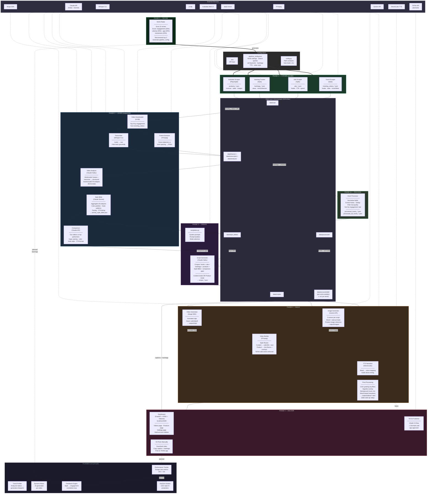
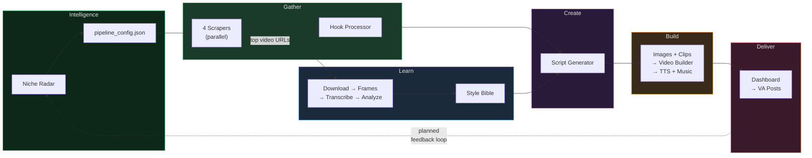
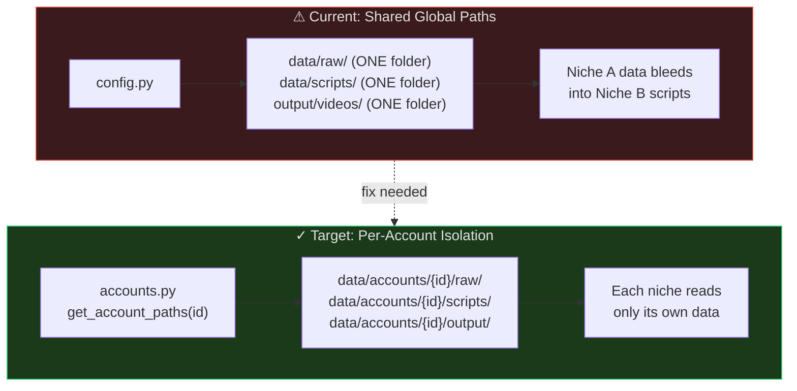

# TikTok Factory — Full Architecture Diagram

Unified Mermaid diagram of the complete pipeline. Renders natively on GitHub.

---

## Complete System Architecture

---

## Data Flow Summary

---

## Known Issue: Data Isolation Gap

