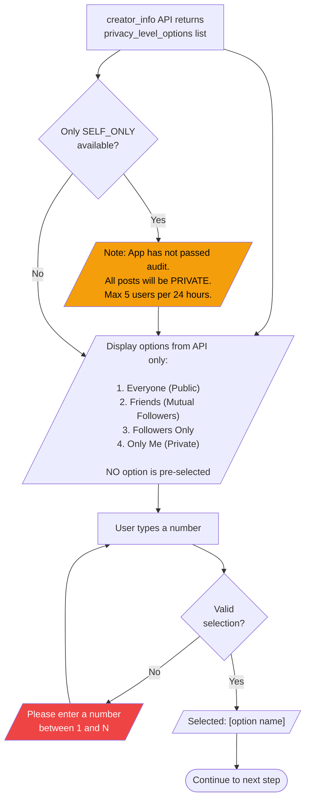
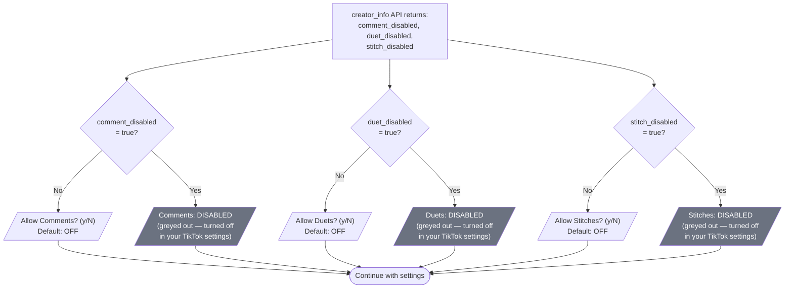
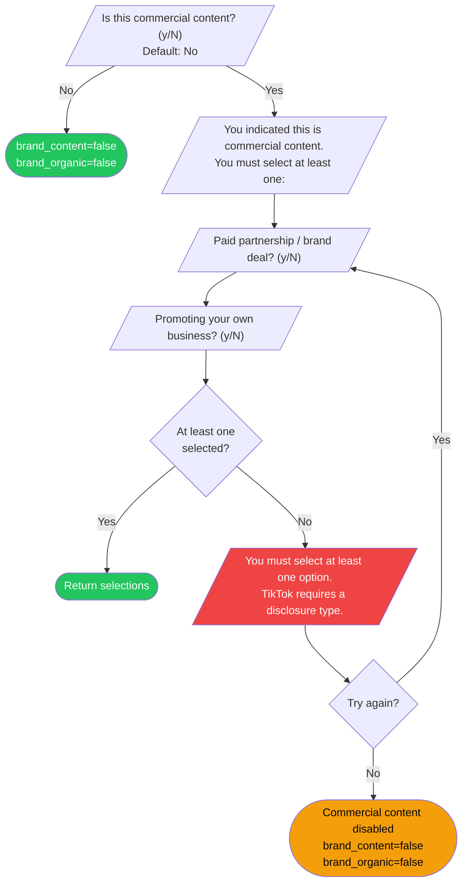
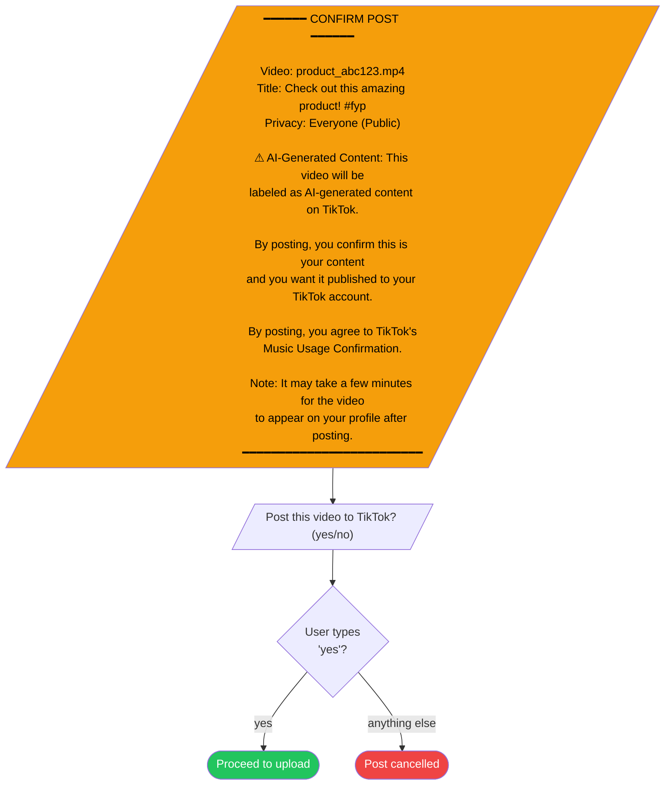
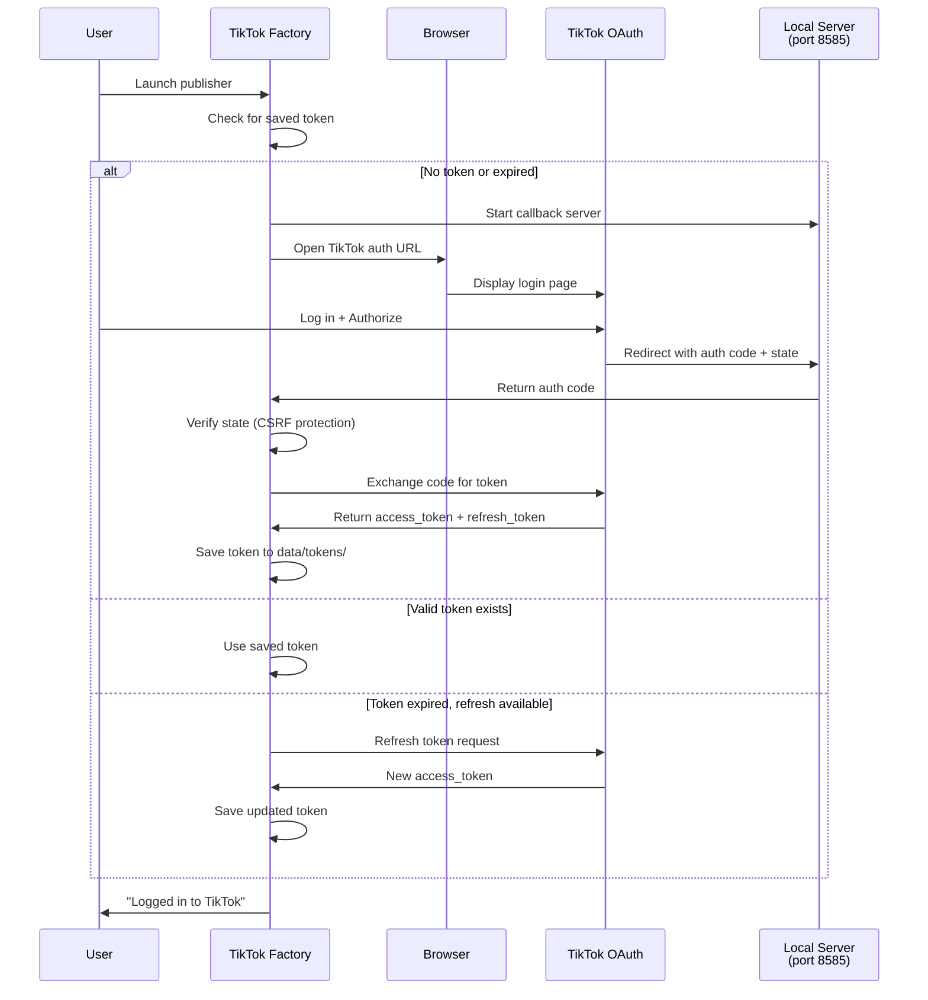
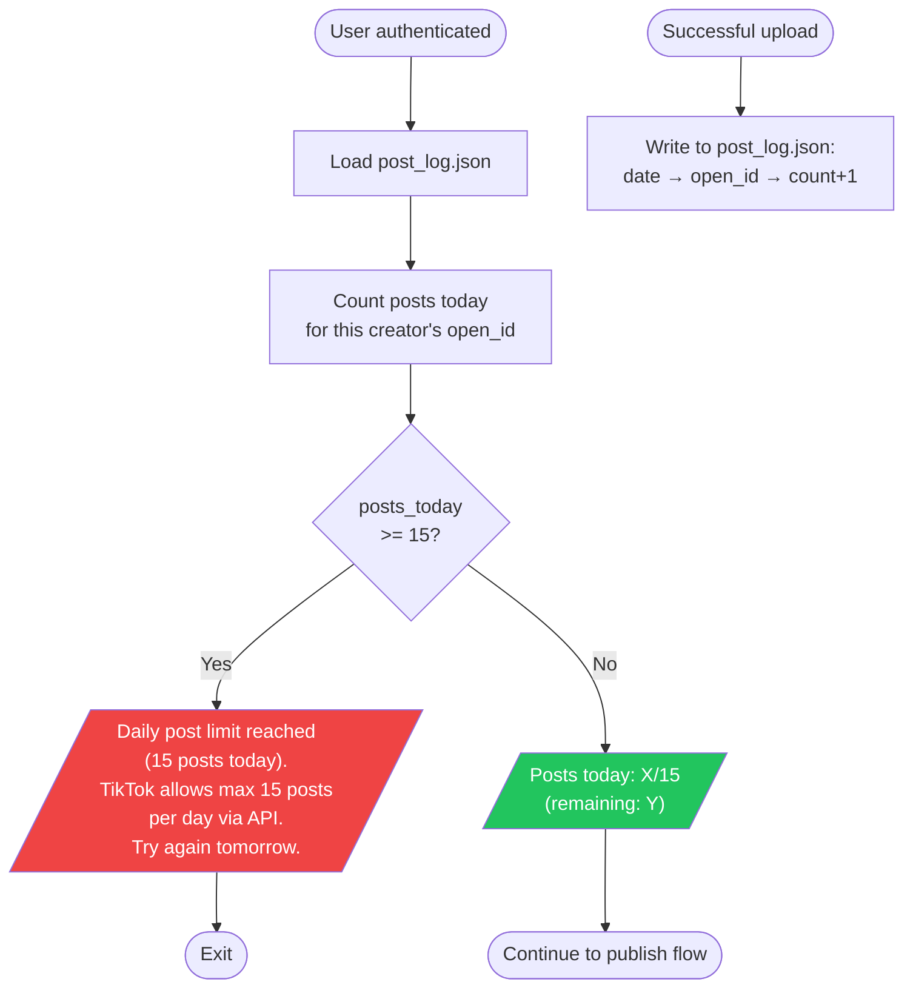
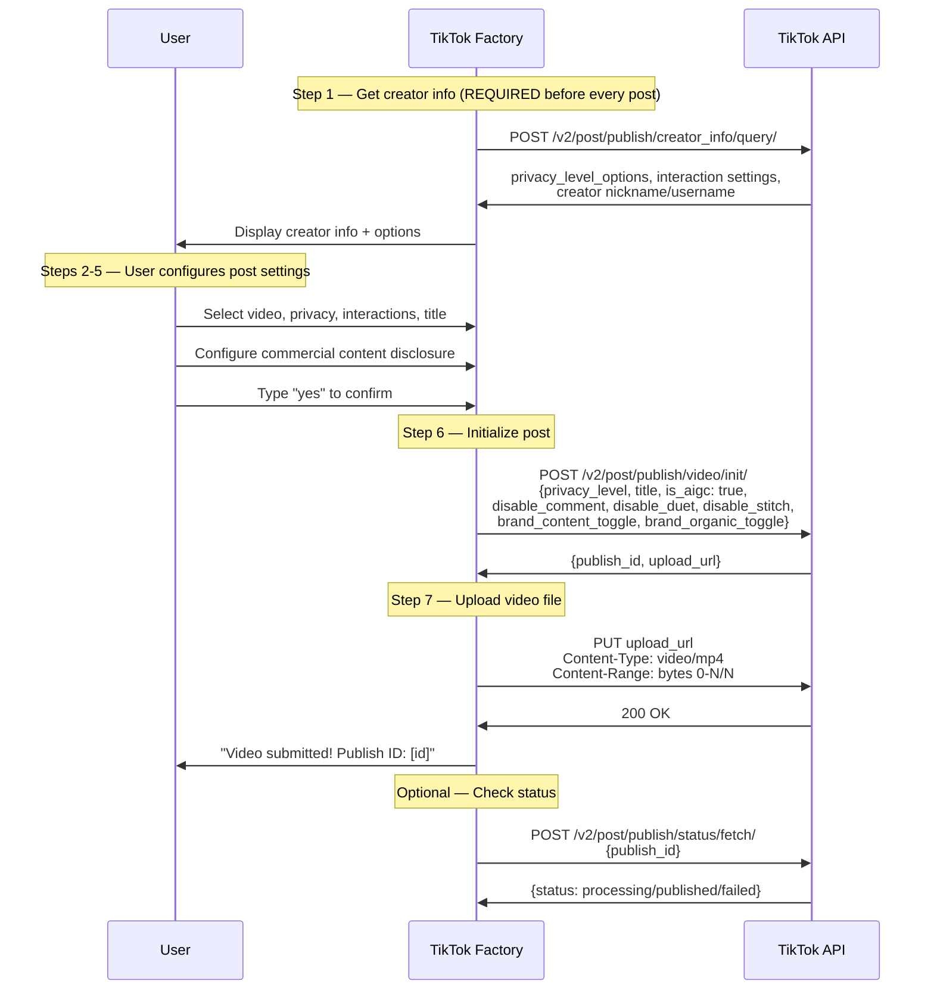

# TikTok Content Factory — UX Flow Mockups

> **For TikTok Developer App Review Submission**
> Convert this document to PDF before submitting.

---

## 1. Complete Publishing Flow Overview

This diagram shows the full user journey from login to post confirmation. Every decision point requires explicit user action — no auto-posting occurs at any step.

```mermaid
flowchart TD
    START([User launches Publisher]) --> LOGIN_CHECK{Saved token<br/>exists?}

    LOGIN_CHECK -->|No| OAUTH[Open TikTok OAuth<br/>login in browser]
    LOGIN_CHECK -->|Yes| EXPIRED{Token<br/>expired?}

    EXPIRED -->|Yes| REFRESH[Auto-refresh token<br/>using refresh_token]
    EXPIRED -->|No| RATE_CHECK

    OAUTH --> AUTHORIZE[User logs in &<br/>clicks Authorize]
    AUTHORIZE --> CALLBACK[OAuth callback<br/>captures code]
    CALLBACK --> TOKEN_EXCHANGE[Exchange code<br/>for access token]
    TOKEN_EXCHANGE --> SAVE_TOKEN[Save token locally]
    SAVE_TOKEN --> RATE_CHECK
    REFRESH --> RATE_CHECK

    RATE_CHECK{Daily post<br/>limit reached?}
    RATE_CHECK -->|Yes, 15/day| LIMIT_MSG[/"Display: Daily limit reached<br/>Try again tomorrow"/]
    LIMIT_MSG --> STOP([Exit])
    RATE_CHECK -->|No| CREATOR_INFO

    CREATOR_INFO[Call creator_info API<br/>Get privacy options &<br/>interaction settings]
    CREATOR_INFO --> CREATOR_DISPLAY[/"Display: Posting as<br/>[nickname] @[username]<br/>Posts today: X/15"/]

    CREATOR_DISPLAY --> VIDEO_SELECT[User selects video<br/>from output/videos/]
    VIDEO_SELECT --> PREVIEW[/"Display video preview:<br/>filename, size, script content<br/>(hook, body, CTA)"/]

    PREVIEW --> PRIVACY[User selects privacy level<br/>from API-provided options<br/>NO default value]
    PRIVACY --> INTERACTIONS[User toggles interactions<br/>Comment / Duet / Stitch<br/>ALL off by default]
    INTERACTIONS --> TITLE[User enters title/caption<br/>max 2200 chars]
    TITLE --> COMMERCIAL{User: Is this<br/>commercial content?}

    COMMERCIAL -->|No| CONFIRM
    COMMERCIAL -->|Yes| DISCLOSURE_TYPE{Must select at least one:<br/>Brand deal OR<br/>Own business}
    DISCLOSURE_TYPE --> CONFIRM

    CONFIRM[/"CONFIRM POST panel:<br/>• Video filename<br/>• Title<br/>• Privacy level<br/>• AI-generated content notice<br/>• Music Usage Confirmation<br/><br/>User must type 'yes' to proceed"/]

    CONFIRM --> CONSENT{User types<br/>'yes'?}
    CONSENT -->|No| CANCEL([Post cancelled])
    CONSENT -->|Yes| UPLOAD[Upload video to TikTok]
    UPLOAD --> LOG[Record post in daily log]
    LOG --> SUCCESS[/"Video submitted!<br/>Publish ID: [id]<br/>Check status with --status flag"/]
    SUCCESS --> DONE([Exit])

    style OAUTH fill:#1da1f2,color:#fff
    style AUTHORIZE fill:#1da1f2,color:#fff
    style CONFIRM fill:#f59e0b,color:#000
    style CONSENT fill:#f59e0b,color:#000
    style LIMIT_MSG fill:#ef4444,color:#fff
    style SUCCESS fill:#22c55e,color:#fff
    style CANCEL fill:#ef4444,color:#fff
```

---

## 2. Privacy Level Selection — No Default Value

TikTok requires that no default privacy level is pre-selected. The user must actively choose.

---

## 3. Interaction Settings — All Off By Default

TikTok requires all interaction toggles to be OFF by default. Disabled settings must be greyed out.

---

## 4. Commercial Content Disclosure Flow

TikTok requires commercial content disclosure to be OFF by default. If enabled, at least one disclosure type must be selected.

---

## 5. Final Confirmation Panel

This is the last screen the user sees before posting. They must type "yes" to proceed.

---

## 6. OAuth 2.0 Login Flow

---

## 7. Daily Rate Limit Enforcement

---

## 8. API Call Sequence — Publishing a Video

---

## How to Convert to PDF

### Option A: VS Code
1. Install the "Markdown Preview Mermaid Support" extension
2. Install the "Markdown PDF" extension
3. Open this file → Ctrl+Shift+P → "Markdown PDF: Export (pdf)"

### Option B: Mermaid Live Editor
1. Go to [mermaid.live](https://mermaid.live)
2. Paste each diagram individually
3. Export as PNG or SVG
4. Compile into a PDF using any document tool

### Option C: GitHub
1. Push this file to a GitHub repo
2. GitHub renders Mermaid diagrams natively
3. Print the rendered page to PDF (Ctrl+P → Save as PDF)
